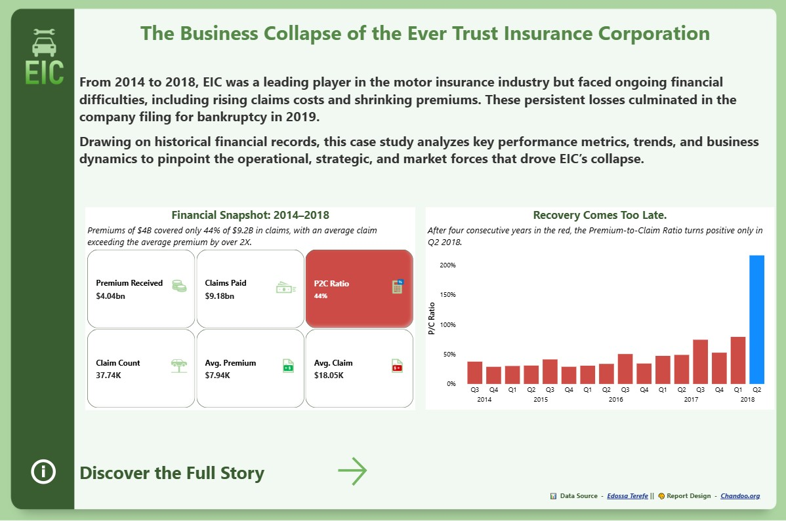
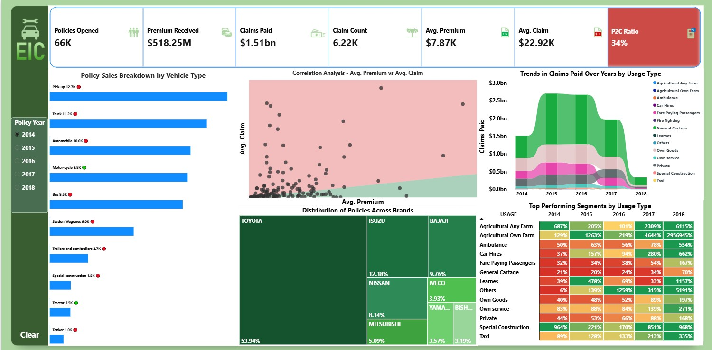

# 📉 The Business Collapse of the Ever Trust Insurance Corporation 
This repository presents a case study on the collapse of **Ever Trust Insurance Corporation (EIC)**, a motor insurance leader from 2014–2018. Rising claims costs and shrinking premiums led to its 2019 bankruptcy. Using historical records, the project analyzes key metrics, trends, and factors behind EIC’s downfall.

# EIC-Insurance-Analysis.
## 📌 Overview:
This repository presents a case study on the collapse of **Ever Trust Insurance Corporation (EIC)**, a former leader in the motor insurance industry from 2014–2018. 
Persistent financial difficulties—including rising claims costs and shrinking premiums—culminated in **bankruptcy in 2019**. 
Using historical financial records, this project examines **key performance metrics, trends, and business dynamics** to identify the operational, strategic, and market forces that drove EIC’s downfall.  

---
## 🖼️ Introduction & Dashboard Preview: 
  
  

---

## 🎯 Objective:  
To deliver an **interactive data-driven dashboard** that highlights EIC’s financial and operational weaknesses, enabling a deeper understanding of the causes of its collapse.  

---

## ⚙️ Tools & Technologies:  
- **SQL** → Data extraction, Data cleaning, and transformation.  
- **Power BI** → Interactive dashboards & visual analytics  

---

## 🔑 Key Findings:

- 🚛 **Trucks Sank the Ship** — $2.9B in losses, mispricing destroyed margins.  
- 🚦 **Overexposure to High-Risk Vehicles** — Trucks & buses dominated, structurally unprofitable.  
- 🚌 **Passenger Transport = Hidden Bleed** — $1.2B losses from buses & fleets.  
- 🏍️ **Profitable Niches Ignored** — Motorcycles, agriculture & construction outperformed.  
- 📉 **Premiums Didn’t Match Reality** — Avg. premium $7.9K vs. avg. claim $18K.  
- 📊 **Growth Fueled Decline** — 500K risky policies sold for volume, not profitability.  
 

---

## 🚀 How to Use this Repository:  
1. Clone the repository.
2. Review the dataset and SQL files for preprocessing.
3. Open Power BI dashboards for interactive analysis.

## 🙏 Acknowledgments:
Gratitude to [Chandoo.org](https://chandoo.org) for providing insightful resources and inspiration for dashboard design and data visualization.

## 📌 Author:
  
👨‍💻 **Naseer Syed Qadri**  
🔗 [LinkedIn](https://www.linkedin.com/in/syednaseerudindataanalyst)  

